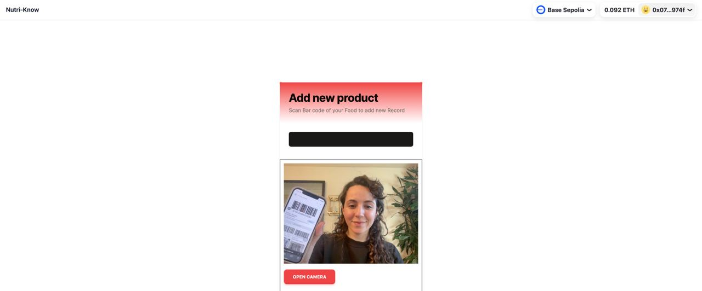

This is a [Next.js](https://nextjs.org/) project bootstrapped with [`create-next-app`](https://github.com/vercel/next.js/tree/canary/packages/create-next-app).

## Run Application locally
Make sure to include ENV variables

```bash
NEXT_PUBLIC_PRIVY_APP_ID=
NEXT_PUBLIC_WALLET_CONNECT_PROJECT_ID=
OPENAI_API_KEY=
MODEL=gpt-4-turbo-preview
NEXT_PUBLIC_MODEL=gpt-4-turbo-preview
```

```bash
npm run dev
# or
yarn dev
# or
pnpm dev
# or
bun dev
```
## Generel Architecture


### Authentication
User Authentication is build using common web3 wallets as well as social logins using Privy, enabling the enduser to have a web2 user login experience.

### Smart contract interaction
The implemented smart contract acts for user management and RBAC roles within the application


### Profile information

### User types
Enduser
Curator

### User dashboard
Scan Barcode

### Verifiable Credentials
Todo: Explain what should happen. Is this implemented?
Issue proof on creation of xyz

### AI Interaction
Explain
Manage content
User experience text based

### Proof of knowledge
Explain
Ensure quality contribution / no fake

## User Flow

### Login / Connect wallet
The user has two options to log into his account:

1. Connect wallet (done)

Common connect wallet, using common wallets like MetaMask

2. Social Login (todo)

Enabling web2 ux like user onboarding using Account Abstraction and social Logins.


(example selection of social logins provided by Privy)

### Join DAO
The user accepts the invite to the DAO by calling a join function on the deployed smart contract.

### Scan new barcode
The user scans barcode of a product. The products nutrition facts form together with the user information the base of the AI prompt generated.

(Enduser scanning Barcode of a product to retrieve nutrition facts)

### Retrieve information of product
The user gets a text based rating of the food provided, including a score.
The user is promopted to attest that those results are accurate. Accepting the prompt creates a new attestation on chain.

(Text based rating of food provided. Prompt to attest the given facts.)

### Validate information on attestation service
The generated attestation can be validated on chain and taken into account on further model development.

(attest on chain)
